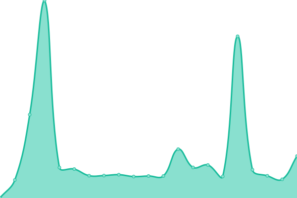
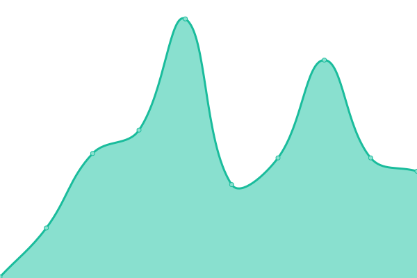

# [📈 Live Status](https://upptime.github.io/upptime): <!--live status--> **🟥 Complete outage**

This repository contains the open-source uptime monitor and status page for [Upptime](https://upptime.js.org), powered by [Upptime](https://github.com/upptime/upptime).

With [Upptime](https://upptime.js.org), you can get your own unlimited and free uptime monitor and status page, powered entirely by a GitHub repository. We use [Issues](https://github.com/upptime/upptime/issues) as incident reports, [Actions](https://github.com/negru/upptime/actions) as uptime monitors, and [Pages](https://upptime.github.io/upptime) for the status page.

<!--start: status pages-->
<!-- This summary is generated by Upptime (https://github.com/upptime/upptime) -->
<!-- Do not edit this manually, your changes will be overwritten -->
<!-- prettier-ignore -->
| URL | Status | History | Response Time | Uptime |
| --- | ------ | ------- | ------------- | ------ |
|  [ns1](http://208.68.19.203) | 🟥 Down | [ns1.yml](https://github.com/negru/upptime/commits/HEAD/history/ns1.yml) | 

 0ms
     
 | 

<a href="https://status.hostdent.com/history/ns1">0.00%</a>
    

|  [MD1](http://208.68.19.200) | 🟥 Down | [md-1.yml](https://github.com/negru/upptime/commits/HEAD/history/md-1.yml) | 

 0ms
     
 | 

<a href="https://status.hostdent.com/history/md-1">0.00%</a>
    

|  [MD2](http://208.68.19.206) | 🟥 Down | [md-2.yml](https://github.com/negru/upptime/commits/HEAD/history/md-2.yml) | 

 0ms
     
 | 

<a href="https://status.hostdent.com/history/md-2">0.00%</a>
    

|  [MD3](http://208.68.19.201) | 🟥 Down | [md-3.yml](https://github.com/negru/upptime/commits/HEAD/history/md-3.yml) | 

 0ms
     
 | 

<a href="https://status.hostdent.com/history/md-3">0.00%</a>
    

|  [MT1](http://mt1.hostdent.com/) | 🟥 Down | [mt-1.yml](https://github.com/negru/upptime/commits/HEAD/history/mt-1.yml) | 

 0ms
     
 | 

<a href="https://status.hostdent.com/history/mt-1">0.00%</a>
    

|  [NS2](https://ns2.hostdent.com) | 🟥 Down | [ns-2.yml](https://github.com/negru/upptime/commits/HEAD/history/ns-2.yml) | 

 0ms
     
 | 

<a href="https://status.hostdent.com/history/ns-2">0.00%</a>
    

|  [NS4](http://208.68.19.204) | 🟥 Down | [ns-4.yml](https://github.com/negru/upptime/commits/HEAD/history/ns-4.yml) | 

 0ms
     
 | 

<a href="https://status.hostdent.com/history/ns-4">0.00%</a>
    

|  [NS7](http://68.148.200.253) | 🟥 Down | [ns-7.yml](https://github.com/negru/upptime/commits/HEAD/history/ns-7.yml) | 

 0ms
     
 | 

<a href="https://status.hostdent.com/history/ns-7">0.00%</a>
    

<!--end: status pages-->

[**Visit our status website →**](https://upptime.github.io/upptime)

## 📄 License

- Powered by: [Upptime](https://github.com/upptime/upptime)
- Code: [MIT](./LICENSE) © [Upptime](https://upptime.js.org)
- Data in the `./history` directory: [Open Database License](https://opendatacommons.org/licenses/odbl/1-0/)
